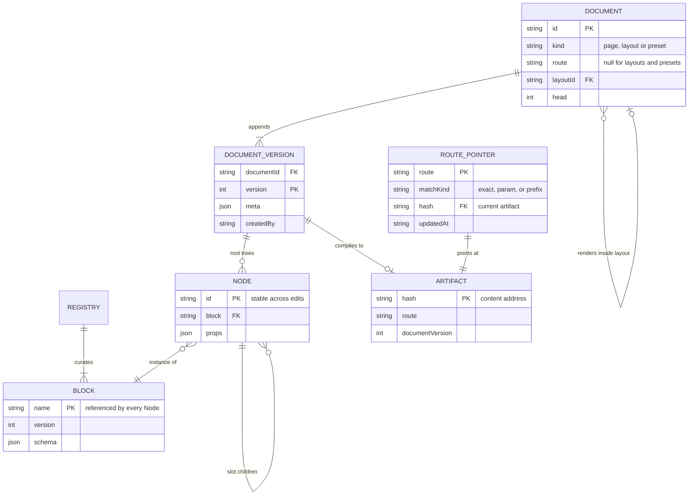
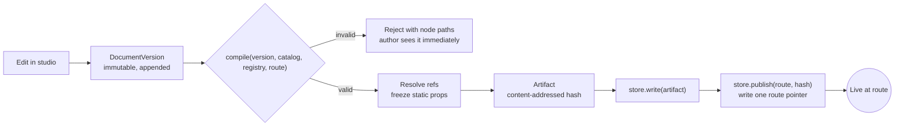
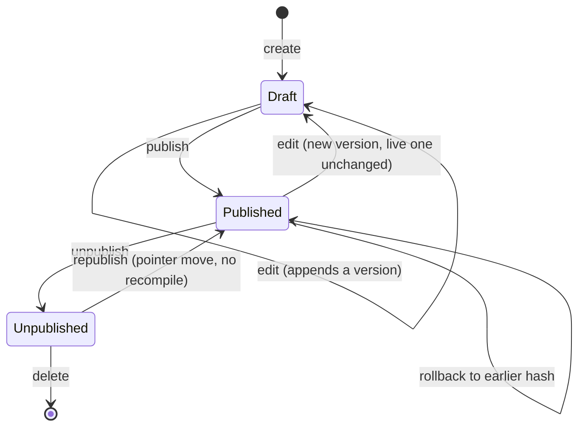

# Domain model

Every entity, what owns it, and where it lives. Types here are pseudocode — illustrative
shape, not final signatures.

## The three layers

| Layer | Entities | Lives in | Mutable? |
|---|---|---|---|
| Contract | `Block`, `Registry` | Code | Only by a commit |
| Content | `Document`, `DocumentVersion`, `Node` | Authoring database | Yes, by authors |
| Output | `Artifact`, `RoutePointer` | Artifact store | Artifacts never; pointers only |

## Relationships



`NODE ||--o{ NODE` is the slot tree the compiler recurses over; `DOCUMENT }o--o| DOCUMENT` is
a page pointing at its layout. That edge is why layouts and presets share one table despite
behaving oppositely.

## Contract layer

### Block

A registered component plus the schema describing what it accepts — the unit of curation. If
it is not a block, an author cannot place it. A block is an organism, a self-contained page
section (hero, FAQ, carousel) — never a button or an input; atoms and molecules are the
consumer's design system, and Nubbin has no opinion on them.

```ts
interface Block<Schema, Component> {
  name: string;              // stable identity, referenced by every Node — renaming is a migration
  schema: Schema;            // Standard Schema; props are inferred from it
  component: Component;      // generic, so core never imports React
  version: number;           // bumped when the schema changes incompatibly
  status?: "active" | "deprecated";  // deprecated stays resolvable; hidden from the studio's placement palette
  slots: Record<string, SlotConstraint>;  // named regions, and what may go in them
}

interface SlotConstraint {
  allow?: readonly string[];   // block names permitted here, each resolved at registration; omitted means any registered block
  min?: number;
  max?: number;
}
```

Slots carry constraints, not just names — a region that takes one-to-six section blocks is
structure a bare `string[]` cannot express. Editing hints are **not** on `Block` — they live
in a parallel `ui` structure keyed by field path. See
[Where UI hints live](api.md#where-ui-hints-live).

`data` (static vs. request-time resolution) is not a field on `Block` either — a block-level
flag forces an all-or-nothing choice per block. It lives per field instead. See
[Data lifecycle is a field hint, not a block flag](api.md#data-lifecycle-is-a-field-hint-not-a-block-flag).

### Structural change

Reshaping an old document is neither something `Block` declares nor something `compile` does:
[a schema change is a republish, not a migration](../decisions/a-schema-change-is-a-republish-not-a-migration.md).
A rename, a split into two blocks, or a `slots` change is a dataset-wide pass over
`DocumentVersion`s, run by a script through the document operations in `core` — an adapter
concern (invariant 5).

### Registry

The curated set for one application. Resolves a `Node.block` string to a `Block`.

```ts
interface Registry {
  get(name: string): Block | undefined;
  names(): string[];
}
```

What an artifact records about the registry, and what the guardrail compares, is on the
[blocks reference](../reference/authoring/blocks.md#registry).

Deletion is two steps: `status: "deprecated"` keeps a block resolvable (`registry.get()`
still returns it, so existing `Node`s keep rendering) while hiding it from the studio's
placement palette. Hard removal follows once nothing references it — a scan over `elements`
values for `block === name`, across every `DocumentVersion`.

## Content layer

### Document

The authored thing. One row per route, not one per environment — staging and production
cannot drift.

```ts
interface Document {
  id: string;
  kind: "page" | "layout" | "preset";
  route: string | null;      // pages have one; layouts and presets do not
  layoutId: string | null;   // the layout a page renders inside
  head: number;              // the version currently considered current
}
```

`publishedVersion` is not stored here — it would duplicate a fact the route pointer already
owns, in a second datastore with no shared transaction. It is derived on read: resolve
`document.route`'s pointer, read the artifact it names, take its `documentVersion`.

### DocumentVersion

Versions are immutable; authoring appends. Publishing moves a pointer rather than mutating a
row, which makes rollback symmetrical with publish and gives history for free.

Autosave and versioning are different things:

| Layer | Granularity | Lives |
|---|---|---|
| Undo / redo | Per operation | Client working copy — IndexedDB, survives tab close |
| Autosave slot | Debounced tick, overwrites in place | The authoring store — mutable, not a version |
| `DocumentVersion` | Explicit save, periodic checkpoint, or publish | The authoring store — append-only |
| Artifact | Per publish | The artifact store |

```ts
interface AutosaveSlot {
  documentId: string;
  tree: Node[];
  slots: Record<string, Node[]>;
  updatedAt: string;
}
```

A tick overwrites `AutosaveSlot` in place and never enters the version log; the slot is
**promoted** into a new `DocumentVersion` only at the three events above. Undo never touches
the version log either — reverting a *draft* is distinct from `rollback`, which moves the
published pointer.

```ts
interface DocumentVersion {
  documentId: string;
  version: number;
  roots: readonly string[];         // ordered entry elements — see Node, below
  elements: Record<string, Node>;
  meta: DocumentMeta;               // title, description, robots, canonical
  createdAt: string;
  createdBy: string;
}
```

A layout's named slots need no separate field: they are the slots of the nodes `roots`
names. Why a page lists entry elements rather than naming one block that contains them is
[A document has many roots](../decisions/a-document-has-many-roots.md).

| Concern | Answer |
|---|---|
| Client storage | IndexedDB, not JS memory alone — a tab crash loses at most the last tick |
| Debounce | 800ms — losing undo history on reload is an acceptable, bounded trade |
| Reconnect | Discard the pending diff and re-serialize the working copy from memory, rather than trust a patched diff buffer that may have silently diverged |
| Second tab / device | Undefined — the same gap as two concurrent authors. Presence plus a node lock is expected to cover both; unresolved |
| Crash mid-append | A version row is one atomic insert keyed on `(documentId, version)`; `head` advances only after commit — a crash leaves the log short one entry, never a partial one |

Not a CRDT: `{roots, elements}` maps onto a CRDT map-of-records incidentally, from the flat
editing shape, not by choice. Neither Figma nor Linear — both centralized-server collaborative
systems — uses one as its primary sync mechanism; presence plus node locks covers v1, with a
CRDT sync layer left as a later swap.

### Node — flat while authoring, nested once published

The same composition takes two shapes: authoring wants random access, rendering wants a
self-contained tree. See
[Flat while authoring, nested once published](../decisions/flat-while-authoring-nested-once-published.md)
for why.

```ts
// Every editor operation is by id — see DocumentVersion above for the full record.
interface Node {
  id: string;
  block: string;                          // resolves against the Registry
  props: UnknownProps;                    // validated against the block's schema at compile
  slots?: Record<string, readonly string[]>;  // slot name → ordered child ids
}
```

```ts
// Artifact — resolved. No lookups, no dangling references possible.
interface ArtifactNode {
  id: string;
  block: string;
  props: UnknownProps;                                        // frozen fields only — literal values
  holes?: Record<string, "request" | { revalidate: number }>; // path → how the rest resolve at render
  slots?: Record<string, ArtifactNode[]>;
}
```

Every prop lands in exactly one place: a frozen literal in `props`, or an entry in `holes`,
decided per field by `ui.fields[path].data` (default: static) — see
[Data lifecycle is a field hint, not a block flag](api.md#data-lifecycle-is-a-field-hint-not-a-block-flag).

The flat `{roots, elements}` shape (children as id references, not a nested tree) earns its
place in four ways:

- **Editing is `elements[id] = {…}`**, not an immutable deep rebuild — selection, patching,
  moving, and undo all key on ids that are already map keys.
- **Cycles become impossible to publish** — a graph containing one cannot flatten into a
  tree, so compile fails with no special-case depth guard needed in the walk.
- **Dangling references and orphans are detectable** in the same pass.
- **"Which documents reference block X"** is a scan over values — the capability needed
  before a block can be safely deleted from the registry.

`id` is generated once and never regenerated — undo, selection, and diffing depend on it.
Every clone path (copy/paste, duplicate page, instantiating from a preset) must **remap the
whole subtree to fresh ids**, via one shared utility in `core` — explicit in the flat shape,
where a deep object copy could silently share ids by accident.

### Layout and Preset

| Behaviour | Layout | Preset |
|---|---|---|
| Relationship | Referenced by pages | Copied into a new page |
| Editing it | Referenced by every page using it; propagation to published pages is unresolved | Affects nothing already created |
| Stored as | `Document` with `kind: "layout"` | `Document` with `kind: "preset"` |
| Composition | Page tree fills the layout's named slots | Page starts as a clone of the tree |

Naming these apart early is cheap; separating them later is a data migration. `preset` rather
than `template` because Atomic Design's template is this model's Layout — see
[the decision](../decisions/a-copy-once-document-is-a-preset-not-a-template.md).

## Output layer

### Artifact

The compiled result of one document version. Immutable and content-addressed.

```ts
interface Artifact {
  hash: string;                            // content address — the identity
  route: string;                           // literal, param pattern, or prefix — see Route pointer
  documentId: string;
  documentVersion: number;
  blockVersions: Record<string, number>;   // what this was compiled against
  tree: ArtifactNode[];                    // resolved, validated — static fields frozen, request/revalidate fields left as holes
  meta: DocumentMeta;
  compiledWith: string;                    // nubbin version
}
```

### Route pointer

The only mutable state in the output layer — one independently-writable record per route, not
one global document with a version. A single-key write is atomic everywhere it matters (S3
object, DB row, file); two concurrent publishes to different routes never contend, and a
publish to the *same* route is a last-write-wins race scoped to that one key.

```ts
interface RoutePointer {
  route: string;               // literal, param pattern, or prefix
  matchKind: "exact" | "param" | "prefix";
  hash: string;                // artifact currently live at this route
  updatedAt: string;
}
```

| Kind | Example | Matches |
|---|---|---|
| Exact | `/about` | That literal path only |
| Param | `/guides/[city]` | One path segment, captured at render |
| Prefix | `/collections/*` | Any path under it |

`matchKind` is parsed from `route` at publish, not caller-supplied — `[name]` means param, a
trailing `/*` means prefix, anything else is exact. Precedence is most-specific-first: exact
beats param, param beats prefix. Whether authors can create pattern routes is open.

`manifest()` is not a stored document — it is an advisory aggregation read over every
`RoutePointer`, for the studio's route list and CI. No render path reads it; a request
resolves through one pointer.

```ts
interface Manifest {
  routes: RoutePointer[];
  generatedAt: string;
}
```

Publishing writes an artifact, then writes one route pointer. Unpublishing deletes the
pointer; the artifact stays, so republishing is a pointer move rather than a recompile.

### ArtifactStore

The output layer's whole IO surface. The authoring store's interface is undesigned. An adapter implements this; `core` only
ever returns values for it.

```ts
interface ArtifactStore {
  read(hash: string): Promise<Artifact | null>;
  write(artifact: Artifact): Promise<void>;
  manifest(): Promise<Manifest>;                          // advisory aggregation — every pointer
  pointer(route: string): Promise<RoutePointer | null>;    // single-route read; what a request resolves through
  publish(route: string, hash: string): Promise<void>;     // writes one route pointer — matchKind parsed from `route`
  unpublish(route: string): Promise<void>;
}
```

## Compile and publish



Validation happens before an artifact exists, so an invalid page is unpublishable rather than
a render-time failure. The render path only ever sees trees already proven valid.

## Publication state



Editing a published document never touches what is live — it appends a version, and the route
pointer keeps pointing at the old artifact until someone publishes. Rollback and republish are
both pointer moves; rollback additionally runs the compatibility check below first.

## Rollback

`rollback` is `publish(route, oldHash)` — the same pointer move, reusing a hash instead of one
just compiled. A bare pointer move risks resurrecting props frozen against a schema that has
since changed shape underneath them. `checkRollback` reads what the target artifact recorded —
`blockVersions` — and compares it to the registry live now, before the pointer moves.

```ts
function checkRollback(artifact: Artifact, registry: Registry): RollbackCheck;

type RollbackCheck =
  | { compatible: true }
  | { compatible: false; drifted: string[] };  // block names whose registered version has moved since compile
```

A plain function in `core` — no adapter or CI runner required — so the studio can call it
before offering "rollback," and a script can call it from a terminal outside any pipeline.

| `RollbackCheck` | Response |
|---|---|
| `compatible: true` | `store.publish(route, hash)` proceeds |
| `compatible: false` | Reject with `drifted`, or recompile the historical `DocumentVersion` through `compile()` and publish the fresh hash instead — a compile that fails names the nodes to rewrite first |

## What this model has not settled

Five things above are deliberately undecided, so they get settled on purpose rather than by
whoever implements first:

| Undecided | Cost of deciding late |
|---|---|
| Layout slot merge: may a page contribute to several layout slots or exactly one? | The choice changes both the document shape and layout composition rules. |
| Who owns `meta`: the document version or a block placed in the tree? | Ownership determines validation, inheritance, and editing behavior. |
| Localization: one locale per `DocumentVersion` or many? | The choice affects document identity, routing, and publishing. |
| Concurrent editing: is a document-wide lock enough? | The answer determines the authoring store's coordination contract. |
| The authoring store interface: `ArtifactStore` has no counterpart on the content layer. | Every editor and automation client will depend on this boundary. |
